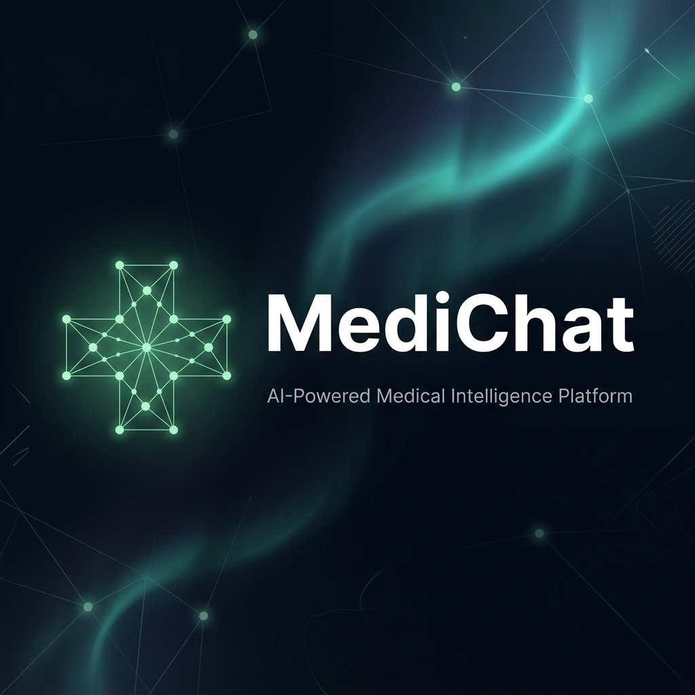
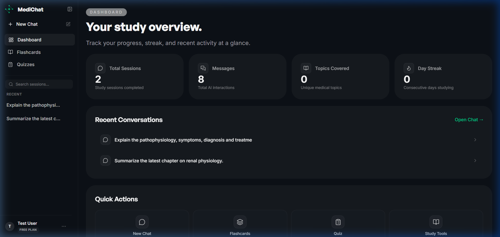
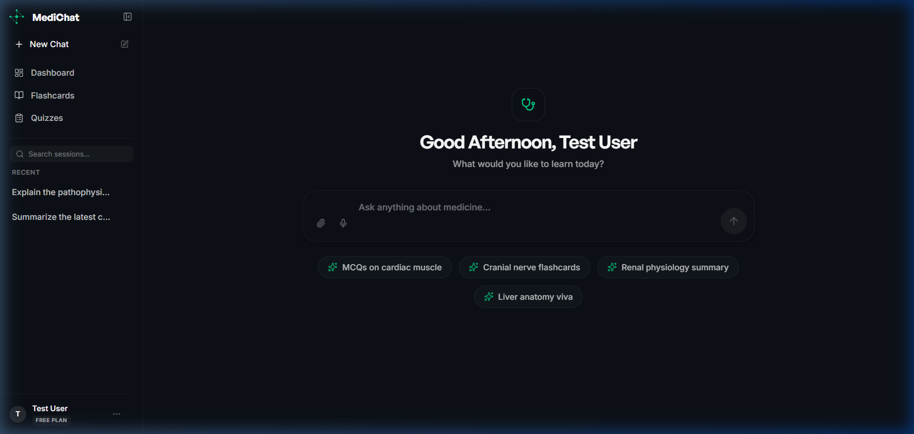
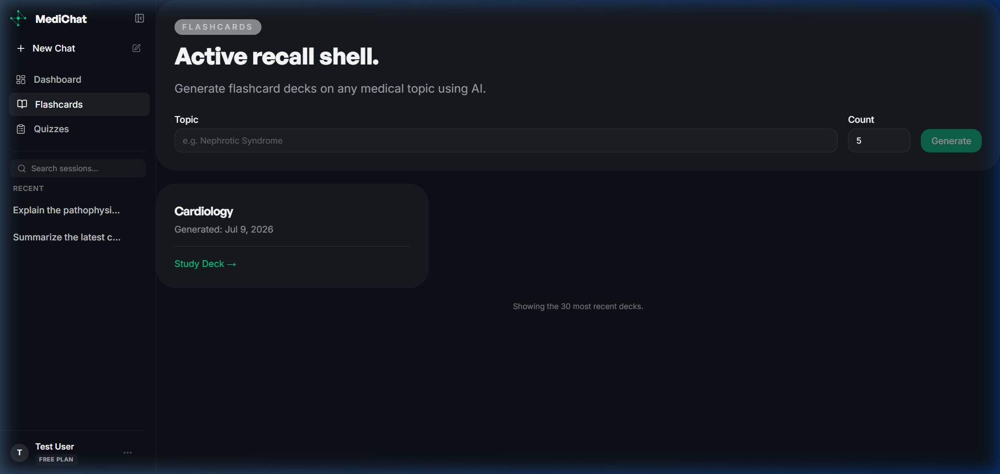
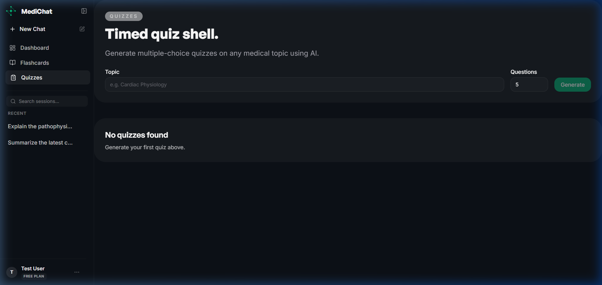
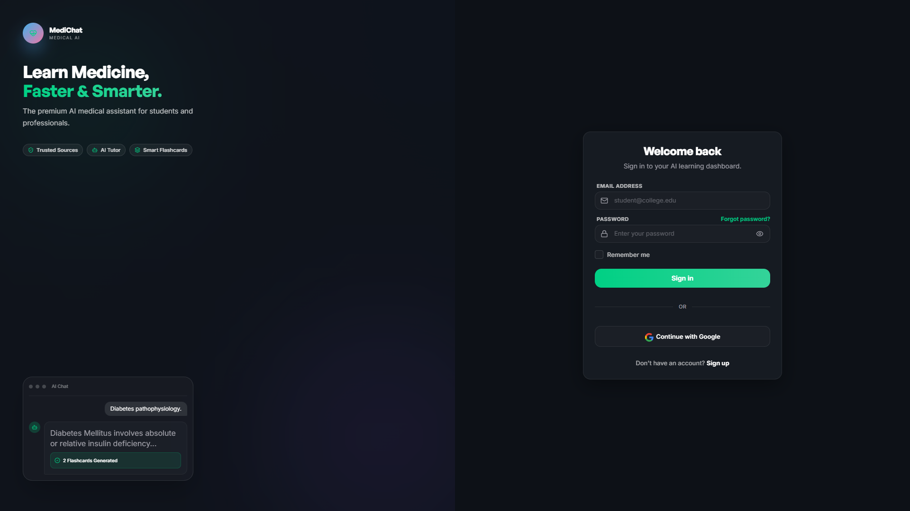

<p align="center">
  
</p>

<h1 align="center">MediChat</h1>
<p align="center">
  <strong>An Intelligent, Production-Ready Medical AI Assistant</strong>
</p>

<p align="center">
  
  
  
  
  
  
  
  
</p>

<p align="center">
  <a href="#project-overview">Overview</a> •
  <a href="#live-demo">Live Demo</a> •
  <a href="#features">Features</a> •
  <a href="#tech-stack">Tech Stack</a> •
  <a href="#architecture">Architecture</a> •
  <a href="#installation">Installation</a>
</p>

---

## 📖 Project Overview

MediChat is a highly optimized, AI-powered medical learning assistant designed to provide accurate medical context, generate study materials, and answer clinical questions using Retrieval-Augmented Generation (RAG). Built with a focus on a premium, ChatGPT-level user experience, MediChat features a sleek, responsive dark-mode UI and a robust, scalable Python backend.

**Key Benefits:**
- **Accurate Medical Context**: Grounded in medical literature via Pinecone Vector Database and LangChain.
- **Interactive Study Tools**: Instantly generate flashcards and quizzes from your clinical conversations.
- **Premium User Experience**: Fluid animations, glassmorphism UI, and beautifully formatted clinical callouts.
- **Secure & Production-Ready**: Implements robust JWT authentication, scalable RAG pipelines, and clean architectural patterns.

---

## 🚀 Live Demo

- **Live URL**: [Placeholder URL](#)
- **Backend URL**: [Placeholder URL](#)
- **API Documentation**: [Placeholder URL](#)
- **Demo Video**: [Placeholder URL](#)

---

## 📸 Screenshots

| Home & Dashboard | Chat Interface |
|------------------|----------------|
|  |  |

| Generated Flashcards | Quiz Interface |
|----------------------|----------------|
|  |  |

| Authentication | Medical Callouts |
|----------------|------------------|
|  |  |

> *Note: For contributors, please create the above screenshots (1920x1080, Dark Mode) and place them in `docs/images/`.*

---

## 🎥 GIF Demonstrations

| Feature | Demonstration |
|---------|---------------|
| **Streaming Responses** |  |
| **Quiz Generation** |  |
| **Theme Switching** |  |

---

## ✨ Features

| Feature | Description |
|---------|-------------|
| 🧠 **AI Medical Chat** | Context-aware medical conversational AI. |
| 📚 **RAG Pipeline** | Vector-search powered responses using Pinecone. |
| ⚡ **Flashcards & Quizzes** | Auto-generate study materials from chat context. |
| 🔒 **Authentication** | Secure JWT-based auth flows via Supabase. |
| 📜 **Session History** | Persistent conversation memory and management. |
| 💅 **Premium Markdown** | Elegant rendering of clinical pearls, code, and tables. |
| 🎨 **Modern Design** | Glassmorphism, animations (GSAP), and responsive UI. |
| 📖 **Citations** | Built-in reference mapping for medical claims. |

---

## 🛠 Tech Stack

### Frontend
- **Framework**: Angular 21
- **Styling**: Tailwind CSS, SCSS
- **Animations**: GSAP
- **Icons**: Lucide Icons
- **Markdown**: ngx-markdown

### Backend & AI
- **Framework**: Flask (Python)
- **Database**: Supabase (PostgreSQL)
- **Vector Store**: Pinecone
- **LLM/Embeddings**: Cohere
- **AI Orchestration**: LangChain
- **Task Queue**: Celery & Redis

### DevOps & Tools
- **Containerization**: Docker
- **Package Managers**: npm, pip

---

## 🏗 Architecture

```mermaid
graph TD
    Client[Angular Frontend] -->|REST / SSE| API Gateway[Flask Backend]
    API Gateway --> Auth[Supabase Auth]
    API Gateway --> DB[(PostgreSQL Supabase)]
    
    API Gateway --> RAG[LangChain Orchestrator]
    RAG -->|Generate Embeddings| Embedder[Cohere Embeddings]
    RAG -->|Similarity Search| VectorDB[(Pinecone Vector DB)]
    
    VectorDB -->|Retrieved Context| RAG
    RAG -->|Context + Prompt| LLM[Cohere LLM]
    LLM -->|Streaming Response| API Gateway
```

---

## 📂 Folder Structure

```
MediChat/
├── app/                  # Flask Backend Application
│   ├── api/              # Controllers and Routes
│   ├── core/             # Configuration and Security
│   ├── rag/              # LangChain & Vector DB logic
│   ├── repositories/     # Data Access Layer (Supabase)
│   ├── services/         # Business Logic Layer
│   ├── tasks/            # Celery Background Tasks
│   └── utils/            # Helper functions
├── frontend/             # Angular 21 Application
│   ├── src/
│   │   ├── app/
│   │   │   ├── core/     # Interceptors, Guards, Services
│   │   │   ├── features/ # Chat, Auth, Dashboard modules
│   │   │   ├── layouts/  # App Shell, Auth Layout
│   │   │   └── shared/   # UI Components, Directives
│   │   └── styles.scss   # Global Tailwind & Prose styles
├── docker/               # Docker & Docker Compose configs
├── docs/                 # Architecture & API documentation
├── requirements.txt      # Python Dependencies
└── package.json          # Node Dependencies
```

---

## ⚙️ Installation

### Prerequisites
- Node.js (v18+)
- Python 3.10+
- Redis (for Celery)

### 1. Clone the repository
```bash
git clone https://github.com/Deepanshukhoushi/Medichat.git
cd Medichat
```

### 2. Environment Variables
Create a `.env` file in the root directory:

| Variable | Purpose | Required | Default |
|----------|---------|----------|---------|
| `FLASK_SECRET_KEY` | Flask session security | Yes | - |
| `SUPABASE_URL` | PostgreSQL DB URL | Yes | - |
| `SUPABASE_KEY` | Supabase Service Key | Yes | - |
| `PINECONE_API_KEY` | Vector DB Access | Yes | - |
| `COHERE_API_KEY` | LLM and Embeddings | Yes | - |

### 3. Backend Setup
```bash
python -m venv venv
source venv/bin/activate  # On Windows: venv\Scripts\activate
pip install -r requirements.txt
python -m app
```

### 4. Frontend Setup
```bash
cd frontend
npm install
npm start
```
*Frontend runs on `http://localhost:4200` and proxies API requests to `http://localhost:8000`.*

---

## 🔄 RAG Workflow (How it works)

1. **User Input**: User asks a medical question.
2. **Controller**: Flask API receives the query.
3. **Embedding**: Cohere generates vector embeddings for the text.
4. **Vector Search**: Pinecone retrieves the top-K relevant medical context chunks.
5. **Prompting**: LangChain injects context and conversation history into a strict medical prompt.
6. **Generation**: Cohere LLM generates the response.
7. **Streaming**: Response is streamed via Server-Sent Events (SSE) back to Angular.
8. **Rendering**: Angular parses Markdown dynamically, rendering elegant clinical callouts and tables.

---

## 📡 API Documentation

| Endpoint | Method | Description | Auth Required |
|----------|--------|-------------|---------------|
| `/health` | GET | Check backend health | No |
| `/login` | POST | Authenticate user | No |
| `/signup` | POST | Register new user | No |
| `/get` | POST | Send message to LLM | Yes |
| `/history` | GET | Fetch chat sessions | Yes |
| `/flashcards` | POST | Generate flashcards | Yes |

*Full API documentation is available in `docs/api.md`.*

---

## 🛡️ Security

- **JWT Authentication**: Secured via Supabase Auth and Angular HttpInterceptors.
- **Input Sanitization**: Angular's strict DOM sanitization prevents XSS.
- **Environment Isolation**: No API keys are exposed to the frontend.
- **Route Guards**: `AuthGuard` protects dashboard and study tools from unauthenticated access.

---

## 💅 UI/UX Design System

- **Invisible Layout**: Chat messages float seamlessly on the canvas without heavy borders, mimicking world-class AI products.
- **Glassmorphism**: Input composers and floating menus utilize background blurs and soft shadows.
- **Medical Callouts**: Custom CSS renders specific markdown blocks into premium medical callouts (e.g., Clinical Pearls, Warnings).
- **Inter Typography**: A strict typography scale ensures massive readability across all viewports.

---

## 📈 Future Improvements

- [ ] Implement full speech-to-text integration.
- [ ] Add PDF upload and document parsing capabilities.
- [ ] Implement real-time collaborative study sessions.
- [ ] Add more comprehensive unit testing (Jest/PyTest).

---

## 🤝 Contributing
Contributions, issues, and feature requests are welcome! Feel free to check the issues page.

## 📄 License
This project is licensed under the MIT License - see the [LICENSE](LICENSE) file for details.

## 👨‍💻 Author

**Deepanshu**
- LinkedIn: [Your LinkedIn Placeholder](#)
- GitHub: [@Deepanshukhoushi](https://github.com/Deepanshukhoushi)
- Portfolio: [Your Portfolio Placeholder](#)
- Email: [Your Email Placeholder](#)

---
<p align="center">
  <i>If you found this project helpful, please leave a ⭐️!</i>
</p>
